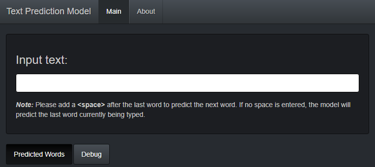

```{r setup, include=TRUE, echo=FALSE}
knitr::opts_chunk$set(echo = FALSE, message = FALSE, warning = FALSE, fig.align = "center")
```

## Objective
This presentation introduces the text prediction application I have created for the [Johns Hopkins University Data Science Specialisation](https://www.coursera.org/specializations/jhu-data-science) 
Capstone Project. The application runs on R and the [Shiny](https://shiny.rstudio.com/) platform.

The application allows the user to input text and receive near-real-time predictions of the next word, or word currently being typed. 
This application aims to replicate the typing suggestions feature found in smartphones.

The application can be accessed via the following URL: [https://8kyle8.shinyapps.io/TextPrediction/]



## Data & Algorithm
The dataset for this project was kindly provided by [SwiftKey](https://www.swiftkey.com/). The dataset contains an English corpora containing text mined from three web sources: blogs, news articles, and [Twitter](https://twitter.com/).

Due to limitations in memory-size and computational times, I created a random sample that is 10% of original size. This amounts to `37.4MB` of text files.

The Natural Language Processing (NLP) algorithm I have chosen is the [N-gram](https://en.wikipedia.org/wiki/N-gram) due to its simplicity and versatility. 
I used the [*quanteda*](https://quanteda.io/) package to clean the text data (remove numbers, punctuations, symbols) and create tokens and document-features-matrices for the 1-gram, 2-gram, 3-gram, and 4-gram models. The frequency of each n-gram feature is calculated and these n-gram models are converted to frequency [*tibble*]() dataframes.

*Example:* Top 3 most likely features from the 4-gram model:

```{r, comment=""}
library(dplyr)
my.dir <- "model01"
load(file = paste0(my.dir, "/", "df_n4.rda"), verbose = FALSE)
df.n4 %>% arrange(desc(freq)) %>% head(3)
```

## Algorithm

The algorithm accepts a character phrase input from the user which is pre-processed by removing all characters other than letters and space. It is then split into a vector containing individual words. If input string contains > 4 words, the last 4 words are kept.

To replicate the smartphone typing suggestions experience, a new word will only be suggested if the last character of the input string is a space. If not, the algorithm assumes that the user has not finished typing the last word in the string and will attempt to find a matching complete word.

Let the pre-processed input string be of length `x`. 

1. If the last character is a space, the algorithm will search the (`x-1`)-gram model for the next word.
If the last character is not a space, the algorithm searches the (`x`)-gram model instead.

2. If no likely word is found, the algorithm keeps the last (`x-1`) words of the input string and repeats Step 1.

3. If no word can be found and the string has been reduced to length 1, then the algorithm start searching the 1-gram model based on the first `y=5` characters of the string. If no word can be found, the algorithm searches the 1-gram model based on the first `y-1` characters again.

4. Step 5. is repeated until a word is found. The algorithm **guarantees** that as long as the input string contains English letters, at least one suggestion will be made by the algorithm.

## Demonstration

User input: <span style="color:red">**This coming sunday I will cook **</span> *Note the last character is a space.*

1. Pre-processed to **i will cook **

2. Checks 4-gram to predict word after **i will cook**, no match found.

3. Shortened to **will cook **

4. Checks 3-gram to predict word after **will cook**. Found matches. Top 5 matches: <span style="color:blue">**for</span>, <span style="color:blue">the</span>, <span style="color:blue">until</span>, <span style="color:blue">in</span>, <span style="color:blue">and**</span>.

User input: <span style="color:red">**mix some potassi**</span> *Note the last character is * not *a space. Word is incomplete.*

1. Checks 3-gram to find third words after **mix some**.

2. Filters the third words found by the first 5 characters of the last word, **p o t a s**. Only 1 match found: <span style="color:blue">**potassium**.</span>

Thank you. GitHub: [*https://github.com/8kyle8/10TextPredictionApp*](https://github.com/8kyle8/10TextPredictionApp)